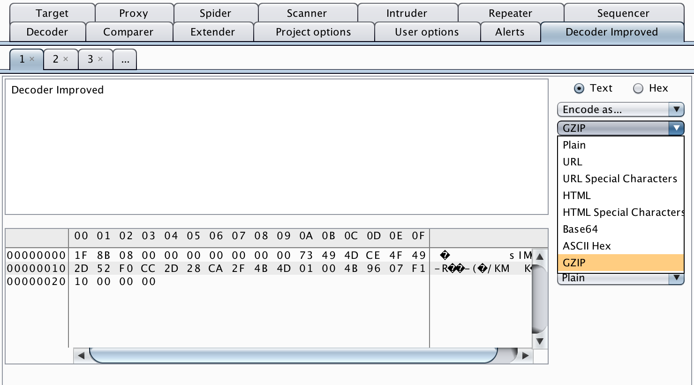

# Decoder Improved

## tl;dr

Within extender load Decoder-Improved.jar. 

For a walkthrough on how to extender Decoder Improved visit 
https://www.nccgroup.trust/us/about-us/newsroom-and-events/blog/2017/october/decoder-improved-burp-suite-plugin-release-part-2/.

## Summary

Burp Suite's built-in decoder component, while useful, is missing
important features and cannot be extended. To remedy this, I developed
Decoder Improved, a drop-in replacement Burp Suite plugin. It includes
all of decoder's functionality while fixing bugs, adding tabs,
and includes an improved hex editor. Additionally, the plugin's
functionality is straightforward to extend to accommodate any custom
data encoding and decoding needs.

## Burp Suite Decoder

Burp Suite includes an easy-to-use data manipulation toolkit that allows
a user to manipulate data by setting a series of transformation filters.
These filters allow users to perform simple data manipulation including
URL, HTML, Base64, ASCII Hex, Hex, Octal, Binary, and Gzip encoding and
decoding; it also includes a few basic hashing functions. Additionally,
Burp Suite's decoder has a hex editor and a "smart decode" option
that automatically picks a reasonable decoding method. While this set of
functionality is useful, it suffers from several issues that limit it
heavily:

+ It does not have tabs, which prevents a user from manipulating multiple pieces of data separately. 
+ It fails to handle non-ASCII data correctly. 
+ Its hex editor is severely limited and cannot be extended via the Burp Extender API to perform custom encoding and decoding.

## Decoder's Weaknesses

### A Lack of Tabs

Unlike many of Burp's other features, the decoder does not support tabs
which makes managing multiple chunks of data difficult.

### A Difficult to Use Hex Editor

The included hex editor requires users to right click to insert new
bytes or delete existing bytes. Additionally, each byte in the hex
editor is a text box making data entry difficult.

### Cannot Handle Non-ASCII Text

Decoder truncates text characters to one byte, mangling Unicode
characters. This makes dealing with non-English character sets brutal.

### Impossible to Extend

Because Burp Suite is closed-source, it is not feasible to fix bugs and
extend the existing decoder.

## Decoder Improved

Decoder Improved is a data transformation plugin for Burp Suite that
better serves the varying and expanding needs of information security
professionals. Decoder Improved includes the following useful
features:

### All of the Built-in Burp Decoder Modes

Decoder Improved supports all of decoder's encoding, decoding,
and hashing modes. Decoder Improved can encode and decode URL, HTML,
Base64, ASCII Hex, and GZIP. Additionally, Decoder Improved can hash
data using MD2, MD5, SHA, SHA-224, SHA-256, SHA-384, and SHA-512.

### Tabs

Like many of Burp Suite's features, Decoder Improved has support for
tabs, enabling users to manipulate separate pieces of
data simultaneously without having to erase existing work.

### Unicode Support

Decoder Improved is backed by arrays of Java Bytes that do not truncate or
modify Unicode characters through the modification process. Because
Java's Swing elements support displaying Unicode characters, so does
Decoder Improved.

### An Improved Hex Editor 

Decoder Improved comes bundled with the Delta Hexadecimal Editor, a
swing Hex Editor, developed by the [ExBin](http://www.exbin.org/)
project. Delta provides an improved hex editing experience over the
built-in decoder's hex editor by allowing easy insertion and removal,
highlighting, and Unicode support.

### Arbitrary Numeric Base Conversion

Decoder Improved can convert any number represented in base 2 to base 32
(the largest base supported by Java) to its representation in any other
base between base 2 and base 32.

### Regex Find and Replace

Decoder Improved can perform regular expression find and replace over
input to quickly transform text.

### HTML/URL Encode Only Special Characters

When HTML and URL encoding strings in decoder, every
character in the string is encoded, which limits human readability
and occasionally trips broken input filtering rules.
Decoder Improved includes encoding modes that only encode special
characters while leaving alphanumerics untouched.

### Every Hashing Algorithm Available in BouncyCastle

In addition to every hashing algorithm exposed within Burp Suite's
built-in decoder, Decoder Improved exposes every hashing algorithm
included in the BouncyCastle Java crypto library. In contrast, decoder
only contains a smattering of hashing algorithms that do not
cover the entire range of hashing needs encountered during testing.

### An Easy Extension Interface

In the next blog post covering Decoder Improved, we will walk through
examples of how to extend Decoder Improved and add new encoding modes,
including a "FooBar" encoder and a "Text Replace" mode.
